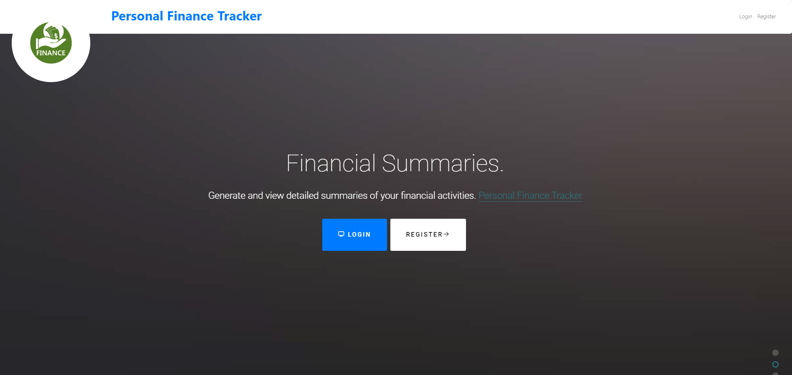
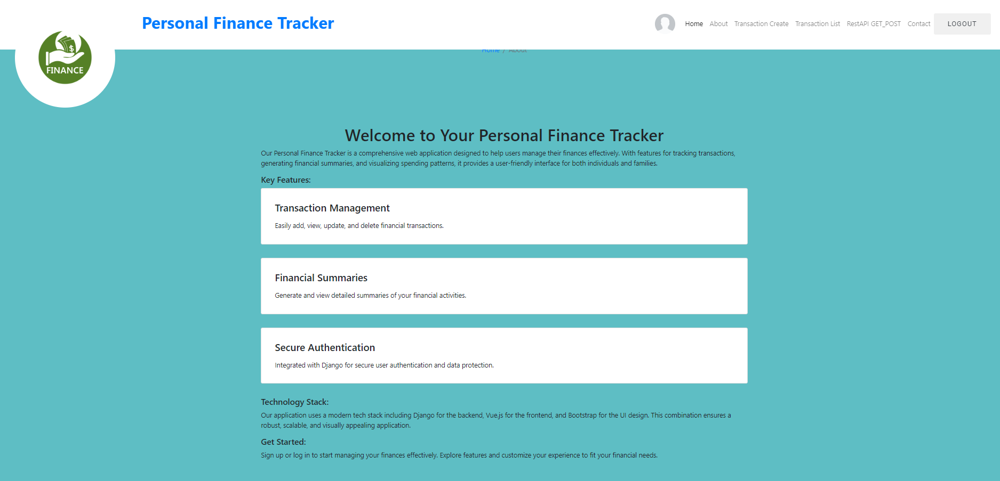
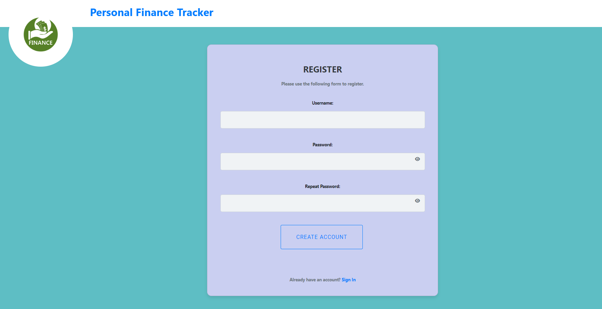
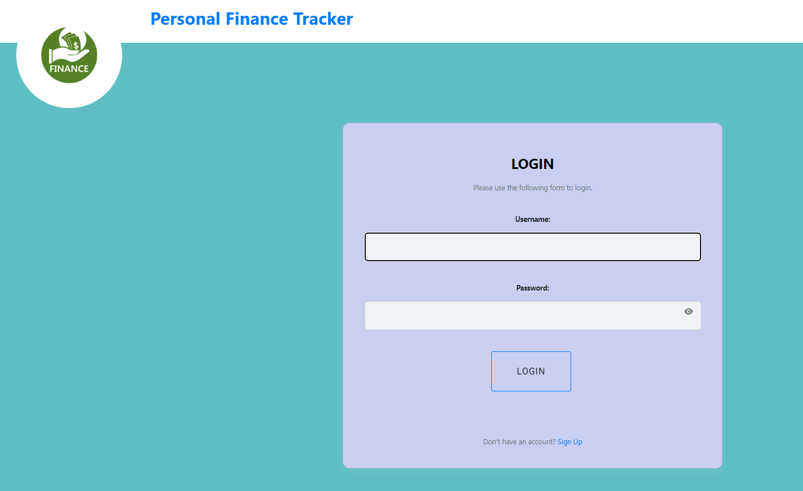
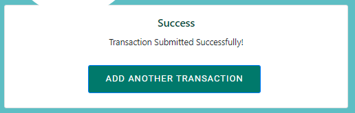
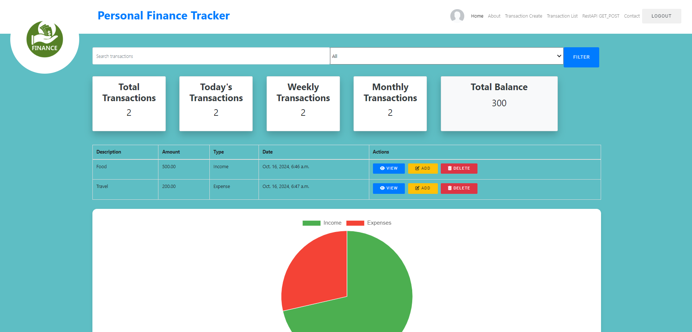
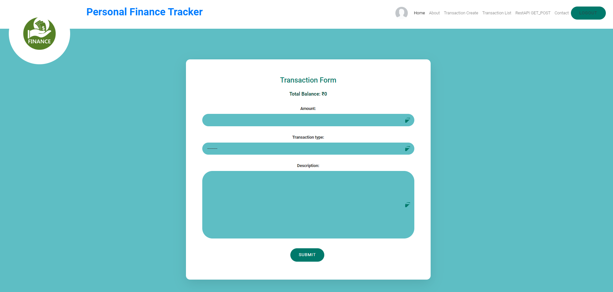

# Personal Finance Tracker

The **Personal Finance Tracker** is a web-based application that allows users to efficiently manage their finances. With features like income and expense tracking, financial summaries, and graphical insights, users can monitor their financial health in real-time. Built with Django for the backend and Vue.js for the frontend, the application provides a seamless experience for managing transactions.

## Key Features:
- **User Authentication:** Secure user registration and login using JWT-based authentication.
- **Transaction Management:** Add, edit, and delete income/expense transactions with ease.
- **Budget Tracking:** Set financial budgets and receive alerts when expenses exceed the limits.
- **Dashboard:** Displays categorized summaries of income and expenses with graphical representation.
- **REST API:** Exposes endpoints for managing transactions and user data using Django REST Framework (DRF).
- **Responsive Design:** The application is mobile-friendly, offering a smooth experience across devices.
  
---


## REST API Endpoints:

| HTTP Method | Endpoint                        | Description                               |
|-------------|----------------------------------|-------------------------------------------|
| GET         | `/api/transactions/`             | Fetch all transactions                    |
| POST        | `/api/transactions/`             | Create a new transaction                  |
| GET         | `/api/transactions/{id}/`        | Get details of a specific transaction      |
| PUT         | `/api/transactions/{id}/`        | Update a transaction                      |
| DELETE      | `/api/transactions/{id}/`        | Delete a transaction                      |
| POST        | `/api/users/register/`           | Register a new user                       |
| POST        | `/api/users/login/`              | User login and JWT token generation       |
| GET         | `/api/users/profile/`            | Get user profile data                     |

---

## Screenshots

### Home


### About


### Register


### Login


### Success Message


### Transaction Details


### Form


---

## Objectives

- **Budget Tracking:** Implement a feature where users can set budgets for various categories, such as groceries, transportation, etc., and receive alerts when their expenses exceed these limits.
- **Reporting:** Provide users with the ability to generate monthly and annual financial reports to analyze their spending and saving patterns over time.
- **Graphical Insights:** Integrate graphical libraries such as Chart.js to allow users to visualize their income and expenses using charts (e.g., pie charts, bar graphs) and track trends over time.

---

## Technologies Used

- **Backend (Django):**
  - Django 3.x
  - Django REST Framework (DRF) for API creation
  - SQLite for local database storage (switchable to PostgreSQL or MySQL)
  - JWT Authentication for secure user login

- **Frontend (Vue.js):**
  - Vue.js 3.x
  - Vue Router for page navigation (e.g., Dashboard, Transaction List)
  - Vuex for state management (managing global state such as transactions and user data)
  - Axios for making HTTP requests to the Django REST API

---

## Installation Guide

### Backend (Django)

1. **Clone the repository:**

   ```bash
   git clone https://github.com/your-username/PersonalFinanceTracker.git
   cd PersonalFinanceTracker/backend
   ```

2. **Set up a virtual environment and activate it:**

   ```bash
   python3 -m venv venv
   source venv/bin/activate  # For Windows use venv\Scripts\activate
   ```

3. **Install required Python dependencies:**

   ```bash
   pip install -r requirements.txt
   ```

4. **Apply database migrations:**

   ```bash
   python manage.py migrate
   ```

5. **Create a superuser for accessing the admin panel:**

   ```bash
   python manage.py createsuperuser
   ```

6. **Run the Django development server:**

   ```bash
   python manage.py runserver
   ```

7. Open `http://127.0.0.1:8000/admin` to access the admin panel, and `http://127.0.0.1:8000/` to access the REST API.

### Frontend (Vue.js)

1. **Navigate to the frontend directory:**

   ```bash
   cd ../frontend
   ```

2. **Install npm dependencies:**

   ```bash
   npm install
   ```

3. **Run the Vue.js development server:**

   ```bash
   npm run serve
   ```

4. Open `http://localhost:8080` to view the Vue.js app in your browser.

---

## API Integration

- The frontend interacts with the backend using Axios to make HTTP requests to the Django REST API. For example, the list of transactions is fetched by calling the `/api/transactions/` endpoint, and the data is stored in Vuex for easy access across components.
  
  ```js
  // Example: Fetching transactions in Vuex action
  async fetchTransactions({ commit }) {
    try {
      const response = await axios.get('/api/transactions/');
      commit('SET_TRANSACTIONS', response.data);
    } catch (error) {
      console.error('Error fetching transactions:', error);
    }
  }
  ```

- **JWT Authentication:** Users are authenticated via JWT tokens, which are sent with each API request. Upon successful login, the token is stored in Vuex and added to the Authorization header for subsequent requests.

  ```js
  axios.defaults.headers.common['Authorization'] = `Bearer ${token}`;
  ```

---

## Testing

### Backend Tests:
To run Django tests:

```bash
python manage.py test
```

### Frontend Tests:
For testing Vue.js components:

```bash
npm run test:unit
```

---

## Future Improvements

- **Recurring Transactions:** Support for recurring transactions (e.g., monthly salary or bills).
- **Currency Support:** Allow users to set their preferred currency and automatically convert transactions to that currency.
- **Analytics and Insights:** Provide more advanced insights, such as forecasting future expenses based on current patterns.

